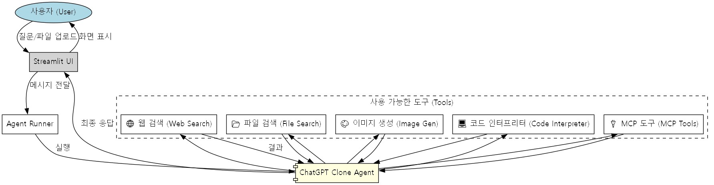

# ChatGPT 클론 에이전트

Streamlit과 OpenAI로 구축된 AI 어시스턴트로, 웹 검색, 파일 분석, 이미지 생성 및 코드 실행이 가능합니다. 이 에이전트는 `openai-agents` SDK를 활용하며 확장된 기능을 위해 Model Context Protocol (MCP)을 지원합니다.

## 주요 기능

- **💬 대화형 채팅 인터페이스**: 원활한 사용자 경험을 위해 Streamlit으로 구축되었습니다.
- **🌐 웹 검색**: 웹 검색 도구를 사용하여 최신 정보를 자동으로 검색합니다.
- **📂 파일 검색**: 텍스트 및 이미지 파일을 업로드하고 질의할 수 있습니다. 효율적인 검색을 위해 벡터 저장소를 사용합니다.
- **🎨 이미지 생성**: 요청에 따라 고품질 이미지를 생성합니다.
- **💻 코드 인터프리터**: 채팅 내에서 Python 코드를 직접 실행하여 문제를 해결하거나 데이터를 분석합니다.
- **🔌 MCP 통합**: 다음을 포함한 외부 도구와 Model Context Protocol (MCP)을 통해 연결됩니다:
    - **Yahoo Finance**: 주식 시장 데이터용.
    - **Timezone Server**: 현지 시간 정보용.
    - **Hosted MCP**: 외부 MCP 서버(예: context7)에 연결합니다.
- **💾 영구 메모리**: SQLite를 사용하여 채팅 기록과 사용자 세션을 저장합니다.

## 워크플로우



## 사전 요구 사항

- Python 3.13 이상
- OpenAI API 키
- `uv` 패키지 관리자 (권장)

## 설치

1.  **레파지토리 복제:**
    ```bash
    git clone <repository-url>
    cd chatgpt-clone-agent
    ```

2.  **환경 변수 설정:**
    루트 디렉토리에 `.env` 파일을 생성하고 OpenAI API 키를 추가하세요:
    ```env
    OPENAI_API_KEY=your_api_key_here
    ```

3.  **의존성 설치:**
    ```bash
    uv sync
    ```

## 사용법

1.  **Streamlit 앱 실행:**
    ```bash
    uv run streamlit run main.py
    ```

2.  **에이전트와 상호작용:**
    - 채팅 입력창에 질문을 입력하세요.
    - 텍스트나 이미지 파일을 업로드하여 분석을 요청하세요.
    - 현재 주가나 다른 지역의 시간을 물어보세요.
    - 이미지 생성이나 코드 실행을 요청하세요.

## 프로젝트 구조

- `main.py`: Streamlit UI와 에이전트 로직을 포함하는 메인 애플리케이션 진입점입니다.
- `dummy-agent.ipynb`: 테스트 또는 데모 목적의 노트북입니다.
- `facts.txt`: 지식 베이스나 테스트에 사용되는 텍스트 파일입니다.
- `user-memory.db`: 세션 데이터를 저장하는 SQLite 데이터베이스입니다.
- `pyproject.toml`: 프로젝트 구성 및 의존성 파일입니다.

## 사용된 기술

- **[Streamlit](https://streamlit.io/)**: 웹 인터페이스용.
- **[OpenAI API](https://openai.com/)**: LLM 및 임베딩용.
- **[Model Context Protocol (MCP)](https://modelcontextprotocol.io/)**: 도구 확장성용.
- **SQLite**: 로컬 데이터 지속성용.
