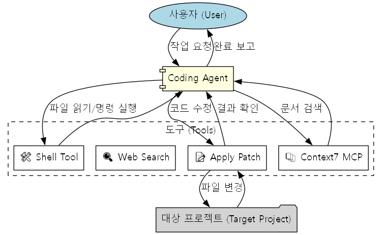

# 코딩 에이전트

쉘 명령 실행, 웹 검색, 코드 패치 적용을 통해 애플리케이션을 빌드하고 수정할 수 있는 정교한 코딩 어시스턴트입니다. 이 에이전트는 `gpt-5.1`을 사용하며 향상된 문서 액세스를 위해 Model Context Protocol (MCP)을 지원합니다.


## 워크플로우



## 설정

1.  **레파지토리 복제:**
    ```bash
    git clone <repository-url>
    cd coding-agent
    ```

2.  **환경 변수 설정:**
    루트 디렉토리에 `.env` 파일을 생성하고 OpenAI API 키를 추가하세요:
    ```env
    OPENAI_API_KEY=your_api_key_here
    ```

3.  **의존성 설치:**
    ```bash
    uv sync
    ```

4.  **대상 프로젝트 준비:**
    이 에이전트는 현재 Next.js 대시보드에서 작업하도록 구성되어 있습니다. 다음 명령을 사용하여 설정할 수 있습니다:

    ```bash
    npx create-next-app@latest dashboard-app \
      --yes --typescript --eslint --tailwind --app --src-dir \
      --import-alias "@/*" --use-npm --no-react-compiler
    ```

    *참고: 에이전트는 특정 디렉토리 구조 내에서 작업하는 것을 예상합니다. 대상 프로젝트에 접근 가능한지 확인하세요.*

## 사용법

1.  **에이전트 실행:**
    ```bash
    uv run agent.py
    ```

2.  **작동 방식:**
    - 에이전트는 미리 정의된 프롬프트(현재 대시보드에 '요약' 버튼 추가)로 시작합니다.
    - 에이전트는 다음을 수행합니다:
        1.  필요한 문서(예: OpenAI API 문서)를 검색합니다.
        2.  프로젝트의 관련 파일을 읽습니다.
        3.  요청된 기능을 구현하기 위해 패치를 적용합니다.
        4.  작업 및 출력을 콘솔에 기록합니다.

## 프로젝트 구조

- `agent.py`: 메인 진입점입니다. 에이전트, 도구를 구성하고 실행 루프를 실행합니다.
- `Instructions.py`: 에이전트에 대한 시스템 지침(생성 vs 업데이트 모드)을 포함합니다.
- `tools/`: 에이전트를 위한 사용자 정의 도구입니다.
    - `shell_tool.py`: 쉘 명령 실행을 처리합니다.
    - `apply_patch.py`: 코드 패치 적용을 처리합니다.
- `shadcn-dashboard/`: (선택 사항) 대상 프로젝트 또는 템플릿을 포함하는 디렉토리일 수 있습니다.

## 사용자 정의

에이전트의 작업을 변경하려면 `agent.py`의 `edit_prompt` 변수를 수정하세요:

```python
edit_prompt = """
여기에 새로운 작업 설명을 입력하세요...
"""
```