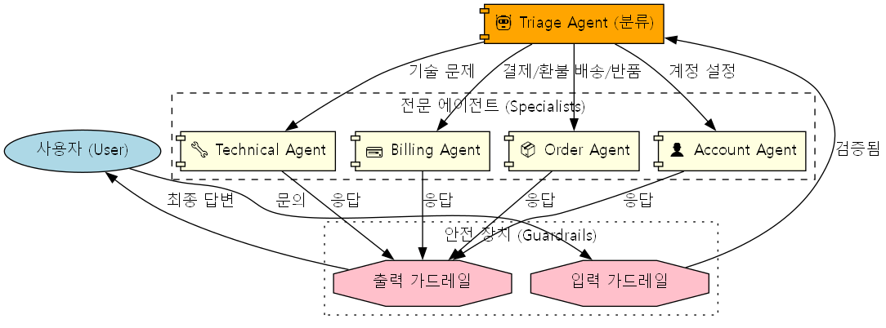

# 고객 지원 에이전트

Streamlit과 OpenAI로 구축된 포괄적인 고객 지원 AI 에이전트입니다. 이 에이전트는 다중 에이전트 오케스트레이션, 지능형 도구 사용, 컨텍스트 관리 및 안전 가드레일과 같은 고급 패턴을 보여줍니다.

## 주요 기능

- **🤖 다중 에이전트 아키텍처**: 전문화된 기능(기술, 청구, 주문, 계정)으로 요청을 라우팅할 수 있습니다.
- **🛡️ 가드레일**: 입력 및 출력 가드레일을 구현하여 응답이 안전하고 관련성이 있으며 특정 에이전트의 역할에 적절한지 확인합니다.
- **🔧 전문화된 도구**:
    - **기술 지원**: 진단 실행, 문제 해결 단계 제공, 엔지니어링 팀으로 에스컬레이션.
    - **청구 지원**: 내역 조회, 환불 처리, 결제 수단 업데이트.
    - **주문 관리**: 상태 확인, 반품 시작, 재배송 예약.
    - **계정 관리**: 비밀번호 재설정, 2단계 인증 활성화, 프로필 업데이트.
- **👤 컨텍스트 인식**: 사용자 컨텍스트(이름, ID, 등급)를 유지하여 개인화된 지원(예: 프리미엄 혜택)을 제공합니다.
- **📝 활동 로깅**: 사이드바에 도구 사용 및 에이전트 핸드오프를 실시간으로 기록합니다.
- **💾 영구 메모리**: SQLite를 사용하여 채팅 세션을 저장합니다.

## 아키텍처 및 워크플로우



## 사전 요구 사항

- Python 3.13 이상
- OpenAI API 키
- `uv` 패키지 관리자 (권장)

## 설치

1.  **레파지토리 복제:**
    ```bash
    git clone <repository-url>
    cd customer-support-agent
    ```

2.  **환경 변수 설정:**
    루트 디렉토리에 `.env` 파일을 생성하고 OpenAI API 키를 추가하세요:
    ```env
    OPENAI_API_KEY=your_api_key_here
    ```

3.  **의존성 설치:**
    ```bash
    uv sync
    ```

## 사용법

1.  **Streamlit 앱 실행:**
    ```bash
    uv run streamlit run main.py
    ```

2.  **에이전트와 상호작용:**
    - 에이전트는 **Triage Agent(분류 에이전트)** 로 시작합니다.
    - 기술 문제, 청구, 주문 또는 계정 설정과 관련된 질문을 하세요.
    - 에이전트가 요청을 해결하기 위해 특정 도구를 어떻게 사용하는지 관찰하세요.
    - 사이드바에서 도구 실행 및 에이전트 활동의 내부 로그를 확인하세요.

## 프로젝트 구조

- `main.py`: 메인 애플리케이션 진입점입니다. Streamlit UI, 세션을 설정하고 에이전트 루프를 실행합니다.
- `tools.py`: 에이전트(기술, 청구, 주문, 계정)가 사용할 수 있는 함수 도구를 정의합니다.
- `models.py`: 사용자 컨텍스트(`UserAccountContext`) 및 가드레일 출력을 위한 Pydantic 모델입니다.
- `output_guardrails.py`: 에이전트가 주제를 벗어난 정보를 논의하는 것을 방지하기 위한 안전 검사를 구현합니다.
- `my_agents/`: 에이전트 정의(예: `triage_agent`)를 포함하는 디렉토리입니다.
- `customer-support-agent.db`: 세션 저장을 위한 SQLite 데이터베이스입니다.

## 주요 학습 개념

- **함수 호출 (Function Calling)**: Python 함수를 LLM을 위한 도구로 정의하고 사용하는 방법.
- **컨텍스트 주입 (Context Injection)**: 사용자별 데이터를 도구 및 에이전트에 전달하는 방법.
- **가드레일 (Guardrails)**: 보조 에이전트를 사용하여 입력 및 출력을 검증하는 방법.
- **Streamlit 통합**: AI 에이전트를 위한 채팅 인터페이스 구축.
