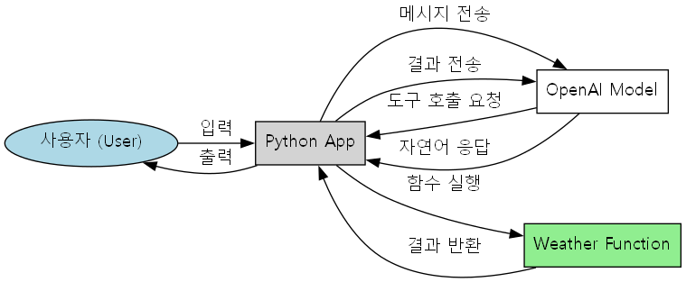

# 나의 첫 번째 에이전트

OpenAI API를 사용하여 AI 에이전트를 구축하는 기초를 보여주는 초보자 친화적인 튜토리얼 프로젝트입니다. 이 프로젝트는 함수 호출(도구 사용)이 가능하고 대화 루프를 유지하는 간단한 에이전트를 만드는 과정을 안내합니다.

## 개요

이 프로젝트는 다음을 이해하도록 돕기 위해 설계되었습니다:
- OpenAI 클라이언트를 초기화하는 방법.
- AI가 사용할 수 있는 사용자 정의 함수(도구)를 정의하는 방법.
- 모델로부터의 "도구 호출(tool calls)"을 처리하는 방법.
- 에이전트와 상호 작용하기 위한 기본 채팅 루프를 만드는 방법.

## 주요 기능

- **🌤️ 날씨 도구**: 하드코딩된 날씨 데이터(예: 아테네는 섭씨 33도)를 반환하는 간단한 함수 `get_weather(city)`입니다.
- **🗣️ 채팅 루프**: 에이전트와 채팅할 수 있는 명령줄 인터페이스입니다.
- **🔧 함수 호출**: OpenAI 응답에서 도구 호출을 파싱하고 해당 Python 함수를 실행하는 원시 메커니즘을 보여줍니다.

## 실행 흐름 (Workflow)



## 사전 요구 사항

- Python 3.13 이상
- OpenAI API 키
- Jupyter Notebook (선택 사항, `.ipynb` 파일 실행용)

## 설치

1.  **레파지토리 복제:**
    ```bash
    git clone <repository-url>
    cd my-first-agent
    ```

2.  **환경 변수 설정:**
    OpenAI API 키가 환경 변수 또는 `.env` 파일에 설정되어 있는지 확인하세요.

3.  **의존성 설치:**
    ```bash
    uv sync
    ```

## 사용법

### Python 스크립트 실행
`reference.py` 파일에는 실행 가능한 전체 코드가 포함되어 있습니다.

```bash
uv run reference.py
```

프롬프트가 나타나면 메시지를 입력하세요. 다음과 같이 물어보세요:
- "아테네의 날씨는 어때?"
- "너는 누구니?"

### 노트북 실행
Jupyter Notebook 또는 VS Code에서 `main.ipynb`를 열어 에이전트 구축의 단계별 구현을 확인하세요.

```bash
jupyter notebook main.ipynb
```

## 코드 구조

- `main.ipynb`: 에이전트 구축의 각 단계를 설명하는 대화형 노트북입니다.
- `reference.py`: 노트북의 로직을 통합한 깔끔한 실행 가능 Python 스크립트입니다.
- `get_weather`: 도구 사용을 보여주기 위해 사용되는 샘플 함수입니다.
- `process_ai_response`: 모델의 응답을 처리하고 요청 시 도구를 실행하는 헬퍼 함수입니다.

## 학습 성과

이 프로젝트를 통해 다음을 배울 수 있습니다:
1.  **도구 정의**: LLM을 위해 JSON 스키마 형식으로 함수를 설명하는 방법.
2.  **메시지 기록**: 사용자, 어시스턴트 및 도구 메시지를 대화 기록에 추가하는 방법.
3.  **실행 흐름**: 사용자 입력 -> 모델 -> 도구 호출 -> 함수 실행 -> 모델 -> 응답의 순환 구조.
