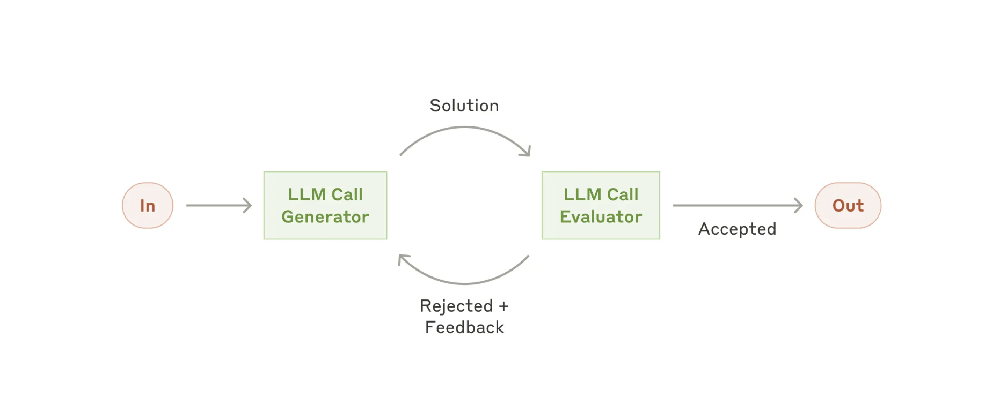

# 1. Prompt Chainning Architecture

프롬프트 체이닝은 작업을 일련의 단계로 분해하며, 각 LLM 호출은 이전 호출의 출력을 처리한다.  
프로세스가 제대로 진행되고 있는지 확인하기 위해 중간 단계에 프로그래밍 방식 검사(아래 다이어그램의 "게이트" 참조)를 추가할 수 있습니다. 
이 워크플로를 사용해야 하는 경우:   
- 이 워크플로는 작업을 고정된 하위 작업으로 쉽고 깔끔하게 분해할 수 있는 상황에 적합합니다.  
- 주요 목표는 각 LLM 호출을 더 쉬운 작업으로 만들어 지연 시간을 줄이고 정확도를 높이는 것입니다.

## 프롬프트 체이닝이 유용한 예:

- 마케팅 카피를 생성한 후 다른 언어로 번역하는 경우

- 문서 개요를 작성하고 개요가 특정 기준을 충족하는지 확인한 다음, 해당 개요를 기반으로 문서를 작성하는 경우

# 2. Routing Architecture

라우팅은 입력을 분류하여 전문화된 후속 작업으로 안내한다.  
이 워크플로를 통해 관심사를 분리하고 더욱 전문화된 프롬프트를 작성할 수 있다.  
이 워크플로가 없으면 한 유형의 입력에 최적화하면 다른 입력의 성능이 저하될 수 있다.

이 워크플로를 사용해야 하는 경우:  
-라우팅은 별도로 처리하는 것이 더 나은 여러 범주가 있고 LLM 또는 보다 전통적인 분류 모델/알고리즘을 통해 분류를 정확하게 처리할 수 있는 복잡한 작업에 적합합니다.

## 라우팅이 유용한 예:  

- 다양한 유형의 고객 서비스 문의(일반적인 질문, 환불 요청, 기술 지원)를 각기 다른 다운스트림 프로세스, 프롬프트 및 도구로 안내합니다.

- 비용과 속도를 최적화하기 위해 쉽고 일반적인 질문은 Claude 3.5 Haiku와 같은 소규모 모델로, 어렵고 특이한 질문은 Claude 3.5 Sonnet과 같은 보다 성능이 뛰어난 모델로 라우팅합니다.

# 3. Parallelization Architecture

LLM은 때때로 한 작업을 동시에 처리하고 그 결과를 프로그래밍 방식으로 집계할 수 있습니다.  
병렬화라는 이 워크플로는 두 가지 주요 변형으로 나타납니다.

- 섹션화: 작업을 병렬로 실행되는 독립적인 하위 작업으로 분할합니다.
- 투표: 다양한 결과를 얻기 위해 동일한 작업을 여러 번 실행합니다.

이 워크플로를 사용해야 하는 경우:  
- 병렬화는 분할된 하위 작업을 병렬화하여 속도를 높이거나, 더 높은 신뢰도의 결과를 위해 여러 관점이나 시도가 필요한 경우 효과적입니다.

- 여러 고려 사항이 있는 복잡한 작업의 경우, LLM은 일반적으로 각 고려 사항을 별도의 LLM 호출로 처리하여 각 특정 측면에 집중할 수 있을 때 더 나은 성능을 발휘합니다.

## 병렬화가 유용한 예:  
- 섹션화:
한 모델 인스턴스가 사용자 쿼리를 처리하는 동안 다른 모델 인스턴스가 부적절한 콘텐츠나 요청을 걸러내는 가드레일을 구현합니다. 이 방식은 동일한 LLM 호출이 가드레일과 핵심 응답을 모두 처리하는 것보다 성능이 더 좋습니다.
LLM 성능 평가를 위한 자동화된 평가. 각 LLM 호출은 주어진 프롬프트에서 모델 성능의 다양한 측면을 평가합니다.

- 투표:
코드의 취약점을 검토하여 여러 프롬프트에서 코드를 검토하고 문제가 발견되면 플래그를 지정합니다.
주어진 콘텐츠가 부적절한지 평가. 여러 프롬프트에서 서로 다른 측면을 평가하거나 거짓 양성과 거짓 음성의 균형을 맞추기 위해 서로 다른 투표 임계값을 요구합니다.

# 4. Orchestrator-workers Architecture

오케스트레이터-워커 워크플로에서 중앙 LLM은 작업을 동적으로 분할하여 워커 LLM에 위임하고 결과를 종합합니다.  

이 워크플로를 사용해야 하는 경우:  
- 이 워크플로는 필요한 하위 작업을 예측할 수 없는 복잡한 작업에 적합합니다(예: 코딩 시 변경해야 할 파일 수와 각 파일의 변경 내용은 작업에 따라 달라질 수 있음).
- 병렬화와 지형적으로 유사하지만, 주요 차이점은 유연성입니다. 하위 작업은 미리 정의되지 않고 오케스트레이터가 특정 입력을 기반으로 결정합니다.

## 오케스트레이터-워커가 유용한 예:  
- 매번 여러 파일에 복잡한 변경을 수행하는 제품 코딩.
- 여러 소스에서 정보를 수집하고 분석하여 관련 정보를 찾는 작업.

# 5. Evaluator-optimizer Architecture

평가자-최적화 워크플로에서 한 LLM 호출은 응답을 생성하고 다른 호출은 루프 방식으로 평가 및 피드백을 제공합니다.  

이 워크플로를 사용해야 하는 경우: 

- 명확한 평가 기준이 있고 반복적인 개선을 통해 측정 가능한 가치를 제공할 때 특히 효과적입니다. 
- 적합도가 높다는 두 가지 징후는 첫째, 사람이 피드백을 명확하게 표현할 때 LLM 응답이 명백하게 개선될 수 있다는 점, 
- 둘째, LLM이 그러한 피드백을 제공할 수 있다는 점입니다. 이는 사람이 완성도 높은 문서를 작성할 때 거치는 반복적인 작성 과정과 유사합니다.

## 평가자-최적화 워크플로가 유용한 예는 다음과 같습니다:

- 번역자 LLM이 처음에는 포착하지 못할 수 있는 미묘한 뉘앙스가 있지만, 평가자 LLM이 유용한 비평을 제공할 수 있는 문학 번역.
- 종합적인 정보를 수집하기 위해 여러 차례의 검색 및 분석이 필요한 복잡한 검색 작업으로, 평가자가 추가 검색의 필요성을 결정하는 경우.
